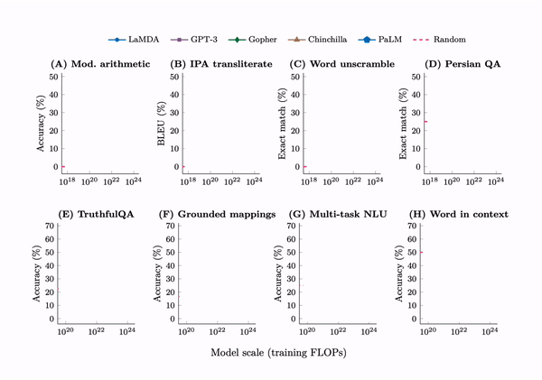

---
# try also 'default' to start simple
theme: seriph
# random image from a curated Unsplash collection by Anthony
# like them? see https://unsplash.com/collections/94734566/slidev
background: https://source.unsplash.com/collection/1309172/1920x1080
# apply any windi css classes to the current slide
class: 'text-center'
# https://sli.dev/custom/highlighters.html
highlighter: shiki
# show line numbers in code blocks
lineNumbers: false
# some information about the slides, markdown enabled
info: |
  ## Slidev Starter Template
  Presentation slides for developers.

  Learn more at [Sli.dev](https://sli.dev)
# persist drawings in exports and build
drawings:
  persist: false
# page transition
transition: slide-left
# use UnoCSS
css: unocss
---

# Destructive Innovation with Generative AI

How Generative AI could improve our workflow

<div class="pt-12">
  <span @click="$slidev.nav.next" class="px-2 py-1 rounded cursor-pointer" hover="bg-white bg-opacity-10">
    Press Space for next page <carbon:arrow-right class="inline"/>
  </span>
</div>

<div class="abs-br m-6 flex gap-2">
  <button @click="$slidev.nav.openInEditor()" title="Open in Editor" class="text-xl slidev-icon-btn opacity-50 !border-none !hover:text-white">
    <carbon:edit />
  </button>
  <a href="https://github.com/amouro/generative_ai_slide" target="_blank" alt="GitHub"
    class="text-xl slidev-icon-btn opacity-50 !border-none !hover:text-white">
    <carbon-logo-github />
  </a>
</div>

<!--
The last comment block of each slide will be treated as slide notes. It will be visible and editable in Presenter Mode along with the slide. [Read more in the docs](https://sli.dev/guide/syntax.html#notes)
-->

---
transition: fade-out
layout: quote
---

# What is your current feeling about the AI?

<div class="flex flex-col gap-4">
  <div class="text-7xl">Anxious ⭐️⭐️⭐️⭐️⭐️</div>
  <div class="text-7xl">Excited ⭐️⭐️⭐️⭐️⭐️</div>
  <div class="text-7xl">No ideas ⭐️⭐️⭐️⭐️⭐️</div>
  <div class="text-7xl text-yellow-400">What else?</div>
</div>
---
transition: fade-out
layout: two-cols

---

# Generative AI
Key Concepts and Applications #byAI

-  **🤹 Artificial Intelligence**: 
  
  <span class="text-sm block pr-6">Generative AI is a subset of AI, where algorithms create new content, designs, or solutions by learning from data.</span>

-  **🛠 Machine Learning**: 

  <span class="text-sm block pr-6">It uses machine learning techniques, particularly deep learning, to train models on large datasets, allowing them to generate new outputs based on patterns they've learned.</span>

-  **🎨 Creativity**: 

  <span class="text-sm block pr-6">Generative AI can create content such as text, images, music, or even code, enabling machines to exhibit human-like creativity in various domains.</span>


::right::

<div class="mt-22"></div>

-  **📝 Data-driven**: 

  <span class="text-sm block pr-6">The quality of generated content depends on the volume and diversity of training data, which helps the AI model to understand context and produce relevant results.</span>

-  **🧑‍💻 Applications**: 

  <span class="text-sm block pr-6">Generative AI is utilized in various industries, including art, marketing, entertainment, research, and automation, providing value by automating tasks, enhancing creativity, and generating novel solutions.</span>

<style>
  strong { 
    @apply text-lightblue-500 text-3xl;
  }
</style>

<!--
You can have `style` tag in markdown to override the style for the current page.
Learn more: https://sli.dev/guide/syntax#embedded-styles
-->

<style>
h1 {
  background-color: #2B90B6;
  background-image: linear-gradient(45deg, #4EC5D4 10%, #146b8c 20%);
  background-size: 100%;
  -webkit-background-clip: text;
  -moz-background-clip: text;
  -webkit-text-fill-color: transparent;
  -moz-text-fill-color: transparent;
}
</style>

<!--
Here is another comment.
-->

---
transition: slide-up
---

# Would you be replaced by AI?

### You won't be, but your work may

<div class="grid grid-cols-2 gap-4 items-end">
  
  
</div>

---
transition: fade-out
---

# Would you be replaced by AI?

### AI <span class="text-lightblue-400 font-extrabold">augement</span> our abilities rather than replace us


---

# Emergence ability
Jason Wei | https://www.jasonwei.net/blog/emergence

<div class="w-3/5 m-auto">


</div>
---
layout: image-right
image: https://source.unsplash.com/collection/94734566/1920x1080
---

# How can we use AI to improve our workflow

1. Semantic Search
1. Video Transcription
1. Design with AI
1. Automate Content Drafting

---

# Semantic Search
Keyword search

<div class="grid grid-cols-2">
<div>

- Query: Where is the world cup?
- Response:
  - **The world cup is** in Qatar. (4 words in common)
  - **The** sky **is** blue. (2 words in common)
  - **The** bear lives in **the** woods. (2 words in common)
  - An apple **is** a fruit. (1 word in common)
  
</div>
<div>

- Query: **Where** in **the world is** my **cup** of coffee?

</div>
</div>

<style>
strong {
  @apply text-lightblue-400;
}
</style>
---

# Semantic Search
Search in Natural Language


<small>https://unaice.com/semantic-search-engine/</small>

---

# Semantic Search
Search in Natural Language

<div class="grid grid-cols-2 gap-4 items-start">


</div>

---
layout: two-cols
---

# Search with AI Robot
ChatGPT with own knowledge database

## Question: 
Show me the latest model name of the **foldable bike**. 

Report in **bullet items** using **markdown** format, including 

1. **Model name**; 
2. **Size/dimension**; 
3. **Description**.


```
Show me the latest model name of the foldable bike. 
Report in bullet items using markdown format, including:
1. Model name; 2. Size/dimension; 3. Description.
```
::right::


<style>
  strong { 
    @apply text-lightblue-500 text-xl;
  }
</style>

---
layout: two-cols
---
# Search similarity
Semantic search using embeddings

## Search phrase: 

**Latest test ride events**

```
recommendation for commuter
```

::right::


<style>
  strong { 
    @apply text-lightblue-500 text-xl;
  }
</style>

---

# Video Transcription
Current workflows


---

# Video Transcription
Current workflows


---

# Video Transcription
Transcribing with OpenAI

<div class="grid grid-cols-7 gap-2 items-start">
  <div class="col-span-4">
    <h3>Transcribe</h3>
    <video class="col-span-2" src="images/whisper_transcribe.mp4" width="600" height="300" controls></video>
  </div>

  <div class="col-span-3">
    <h3>Translate</h3>
    
  </div>
</div>

---

# Video Transcription
Transcribing with OpenAI


---

# Design with AI
MidJourney

<div class="grid grid-cols-4 gap-8">

  <div class="flex flex-col gap-2">
    <h3>Generate</h3>
    
    
  </div>
  <div class="flex flex-col gap-2 items-center">
    <h3>Mixing</h3>
    
    

  </div>
  <div class="col-span-2">
    <h3>Creating details</h3>
    
  </div>
</div>

---

# Design with AI
Galileo AI | https://www.usegalileo.ai/


---

# Automate Content Drafting
Generative Summary with ChatGPT

<div class="grid grid-cols-5 gap-2 items-center">
  <div class="col-span-2 text-sm flex flex-col gap-4">
    <div class="inline-flex items-center">
    <h2>
      What is the magic 
    </h2><span class="text-6xl ml-4">🪄</span>
    </div>
    <div v-click>
      <h4 class="text-lightblue-400 mb-4">It's called "Prompt" / 詠唱</h4>
      <em>Please summarize the following text within 200 characters</em>
    </div>
  </div>

  <div class="col-span-3">
    <video src="images/generative_summary.mp4" width="500" height="300" autoplay controls></video>
  </div>
</div>

<style>
h2, h4 {
  background-color: #2B90B6;
  background-image: linear-gradient(45deg, #c19f51 20%, #f6e5c0 40%);
  background-size: 100%;
  -webkit-background-clip: text;
  -moz-background-clip: text;
  -webkit-text-fill-color: transparent;
  -moz-text-fill-color: transparent;
}
</style>

---

# Automate Content Drafting
Prompt

<div class="grid grid-cols-2 gap-2 items-center">
  <div class="col-span-1">
    Please summarize the following text within 200 characters: 

    [...]
  </div>

  <div class="col-span-1">
    
  </div>
</div>

---

# Automate Content Drafting
Prompt

<div class="grid grid-cols-2 gap-2 items-center">
  <div class="col-span-1 flex flex-col gap-6">
    <div>
      <div class="font-extrabold text-gray-500">SYSTEM:</div>
      <div>
        You are a senior and mature digital media editor who knows how to write an attractive summary and extract the most representative info from a scientific article.
      </div>
    </div>
    <div>
      <div class="font-extrabold text-gray-500">USER:</div>
      <div>
        Please summarize the text in one to <span class="font-mono text-blue-500">[number]</span> sentences only. The total characters must be <span class="font-mono text-blue-500">[length]</span> characters or less.
      </div>
    </div>
  </div>

  <div class="col-span-1">
    
  </div>
</div>
---
transition: fade-out
---

# ChatGPT
What to do with ChatGPT

<div class="grid grid-cols-2 gap-2 items-start">
  <div class="col-span-1">

1. <span class="text-red-600">Do not</span> use it as Search engine <br /><span class="text-green-600">Do</span> ask it to summarize from a provision content
2. <span class="text-red-600">Do not</span> try to jailbrake it <br /><span class="text-green-600">Do</span> instruct it to talk in a template
3. <span class="text-red-600">Do not</span> ask it to calculate <br /> Use <span class="text-green-600">calculator</span>
4. <span class="text-red-600">Do not</span> use vague instruction <br /><span class="text-green-600">Do</span> step by step instruction and start from simple task
  
  </div>

  <div class="col-span-1">
    
  </div>
</div>


---
class: px-20
---

# Challenge in OIST

1. Need python developer and good data scientist 
2. Cost could be high for semantic search
3. Cost is impossible to predict
4. Concerns of the authenticity?
5. Ready to embrace the tool?

---

# Opportunity in OIST

- Government is actively want to leverage the ChatGPT in work. 
- Universities are trying to make policy of using the ChatGPT.
- We are using AI already

---

# What we should do

- Start trying to use AI to improve your work, find how to emplify your efforts
- Think how AI could be part of your work in two years.

---
transition: fade-out
layout: quote
---

# What is your feeling about the AI NOW?

<div class="flex flex-col gap-4">
  <div class="text-7xl">Anxious ⭐️⭐️⭐️⭐️⭐️</div>
  <div class="text-7xl">Excited ⭐️⭐️⭐️⭐️⭐️</div>
  <div class="text-7xl">No ideas ⭐️⭐️⭐️⭐️⭐️</div>
</div>
